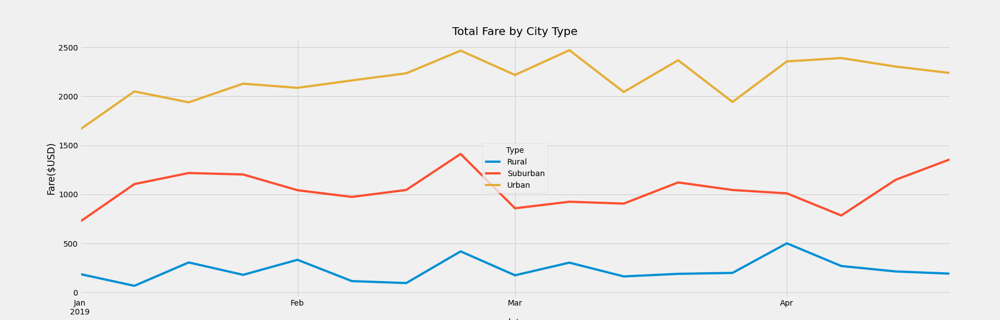

# PyBer Analysis

## Overview 

The purpose of this analysis is to show the viewer how the PyBer data differs by city type and how those disparities can be used to make important business decisons. We are studying three different city types: Rural, Suburban and Urban as well as the number of rides and number of riders during a four-month period. 

## Results 

### Differences Among City Types

When looking at all three city types we have several differences within our summary.

Looking at the dataframe above we can see that the Rural cities have the least number of rides and drivers as well as the least amount of sales during the period but they are the ones the bring the higher fares per ride and driver.

Urban cities bring the most rides and have the most drivers, this correlates with the number of fares but we can see that the average Fare per ride and driver is the lowest of all three. 

Looking at this dataframe we can see that the most profitable rides are from the Rural cities but they are also the ones that we have the least amount during the period.

### Fares Behavior

The behavior of the fares throughout the period can be seen on the following line chart.

Each spike on the line chart represents a weekly period. With this we can see a different view of the behavior on each city type. 

Urban fares seem to increase as the year progresses. More sales during the spring than during the winter. Suburban fares show a big spike during the last week of April but also seem to grow as the summer begins. On the other hand, Rural fares are fairly similar throughout the period.

## Summary

The Business recommendations we can provide based on this analysis are the following:

- Increase the number of drivers in the rural area, this area shows the most profit but the least amount of drivers and total rides. increasing this number might bring the most profit.

- Increase pirce of fares in the suburban areas, the number of rides adn drivers in suburban areas increases significantly compared to rural cities but the average fare per ride and per driver is lower.

- For urban areas, based on this study, I would recommend setting a lower limmit on the fare of shortest trips. with this change even if trips are short, you set a minimum on the profit you can gain.  

